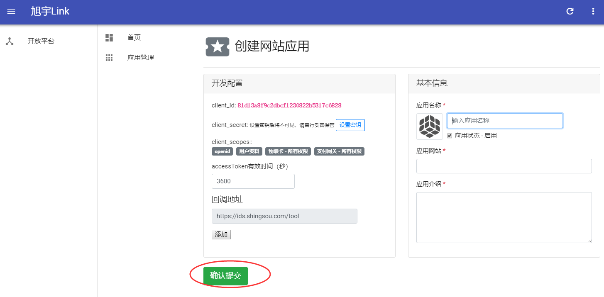
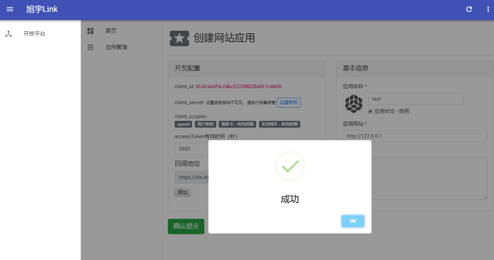
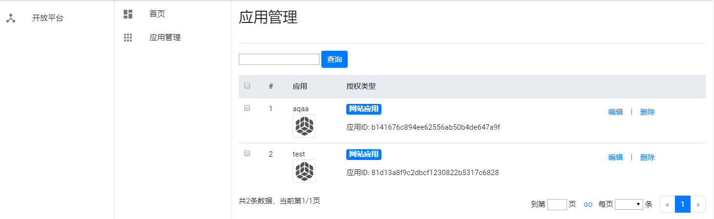
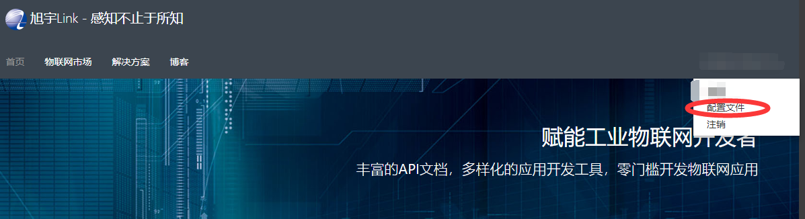

创建应用
========================

.. Note::

    创建应用，根据 :doc:`access_token` 教程，用client_id和client_secret获取access_token。

应用权限（默认）
-----------------

* openid 
* profile 用户资料 
* iot.cardservice.all 物联卡 - 所有权限
* iot.paymentservice.all 支付网关 - 所有权限

1，登陆旭宇开放平台
-------------------

    平台网址：https://open.shingsou.com/

    .. image:: images/registerclient1.png

2，创建应用
-------------

    - 1，应用名称、网址、介绍都必须填写
    - 2，token有效期默认为1小时，可根据需要改成1年或更久
    - 3，client_secret 设置后请自行妥善保存

3，Subscripetion Key
----------------------
    
    - 1，登录 https://portal.shingsou.com
    - 2，订阅这个产品包 https://portal.shingsou.com/products/5aacb21f2f264515a88e75c9    
    - 3，然后点击配置文件查看

4，access_token工具
------------------

    - access_token工具 ：https://ids.shingsou.com/tool

5，支付网关 - SDK下载
-------------------

    
    - https://portal.shingsou.com/docs/services/3

    .. image:: images/registerclient6.png

6，物联卡 - SDK下载
-------------------

    
    - https://portal.shingsou.com/docs/services/2

    .. image:: images/registerclient7.png

7，本地接口调试（Postman工具）
--------------------------------------

    复制下面地址，依次导入到本地

    - 1，https://portal.shingsou.com/docs/services/2/export?DocumentFormat=Swagger
    - 2，https://portal.shingsou.com/docs/services/3/export?DocumentFormat=Swagger

    .. image:: images/registerclient8.png
